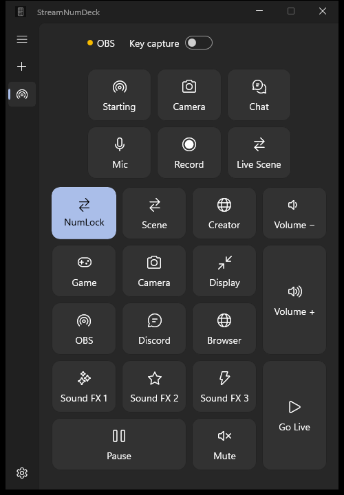

<h1 align="center">StreamNumDeck</h1>

<p align="center">
  <strong>Turn the numpad you already own into a control deck for streaming, gaming, and everyday shortcuts.</strong>
</p>

<p align="center">
  <a href="#english">🇬🇧 English</a>
  &nbsp;•&nbsp;
  <a href="#russian">🇷🇺 Русский</a>
</p>

<p align="center">
  
  
  
  
  
  
  
  
  
  
  
  
  
  
  
  
  
  
  
  
  
  
</p>

<p align="center">
  
</p>

<p align="center">
  <a href="https://github.com/nikartom/StreamNumDeck/releases/latest"><strong>Download StreamNumDeck</strong></a>
  &nbsp;•&nbsp;
  <a href="https://www.donationalerts.com/r/kventinburatino">Support the author</a>
</p>

---

<a id="english"></a>

## English

### Your keyboard can be your Stream Deck

StreamNumDeck turns the numeric keypad and the six navigation keys above it into customizable buttons. Keep playing or streaming while a single key switches an OBS scene, mutes your microphone, plays a sound effect, changes an application's volume, opens a link, runs a keyboard macro, or launches a multi-step automation.

There is no extra device to buy and no need to leave the game or hunt through open windows.

The physical `NumLock` key switches between two independent layers. That gives you up to **44 actions in every profile**. The key background in StreamNumDeck always shows which layer is active.

### What can I do with it?

- Switch OBS scenes and show or hide sources without using `Alt+Tab`.
- Mute the microphone and keep a visible crossed-microphone indicator on any monitor.
- Start or stop recording or streaming, and save the replay buffer from the keyboard.
- Play music, jingles, and sound effects with individual volume and playback behavior.
- Mute Windows audio or adjust master and per-application volume.
- Open a game, browser, folder, file, or website.
- Build multi-step automations that combine OBS, sound, and system actions with configurable pauses and an explicit finish step.
- Run keyboard macros with shortcuts and key sequences.
- Create separate profiles for streaming, gaming, editing, work, or any other setup.

Each key can have a label, one of the included icons, or your own image. Profiles have their own icons and can be switched from the side panel or the system tray.

### Download

StreamNumDeck supports **Windows 10 version 1903 or newer and Windows 11**. Choose either file on the [Releases page](https://github.com/nikartom/StreamNumDeck/releases/latest):

- **Setup — recommended:** a regular per-user installer. It does not require administrator rights and adds StreamNumDeck to the Start menu. An optional desktop shortcut is available during installation.
- **Portable ZIP:** extract the `StreamNumDeck` folder anywhere and run `StreamNumDeck.exe`. No installation is required.

Both packages are small because supported Windows 10 and Windows 11 versions already include the required .NET Framework runtime. The application does not download additional components.

> [!NOTE]
> The current installer is not digitally signed, so Microsoft Defender SmartScreen may show an “unrecognized app” warning. If you downloaded it from this official repository, select **More info → Run anyway**. We do not ask you to install a certificate or disable Windows security.

The portable build stores profiles and settings in `%LocalAppData%\StreamNumDeck`, just like the installed version. This keeps your configuration when switching between the two packages.

### Quick start

1. Start StreamNumDeck and click any key in the on-screen keyboard.
2. Choose an icon, label, action group, and action.
3. Configure the action and save it.
4. Press the same physical key while StreamNumDeck is running.
5. Press `NumLock` to configure and use the second layer.

The numpad and the six-key navigation block can be captured independently from the main window. Capture can also be paused from the tray menu. `Ctrl+Alt+F12` remains available as an emergency capture toggle.

### OBS Studio

StreamNumDeck uses the OBS WebSocket 5.x interface built into current OBS Studio versions. Enable the WebSocket server in OBS, then copy its address, port, and optional password into StreamNumDeck settings.

The connection test only checks access and loads scene/source names. It never starts a stream or recording. Those operations occur only when you explicitly assign and press the corresponding action.

| Group | Actions |
| --- | --- |
| **OBS Studio** | Switch scene; show/hide source; mute/unmute input; start/stop streaming; start/stop recording; save replay buffer; restart media source. |
| **Sound** | Play an audio file; mute/unmute the default microphone; mute Windows audio; adjust master volume; adjust a selected application's volume. |
| **System** | Launch a program; open a file, folder, or web link; run a keyboard macro. |
| **Automation** | Combine actions from the other groups; add pauses; stop the remaining sequence with a finish step. |

### Languages and privacy

The interface automatically follows the Windows display language. StreamNumDeck includes English, Russian, German, French, Spanish, Brazilian Portuguese, Italian, Polish, Ukrainian, Turkish, Dutch, Swedish, Czech, Romanian, Simplified Chinese, Japanese, Korean, Hindi, Arabic, Indonesian, Vietnamese, and Thai.

English and Russian are manually maintained. The other translations are machine-generated and native-speaker corrections are welcome.

StreamNumDeck has no telemetry or advertising. Profiles, assignments, icons, settings, and logs stay on your computer. The OBS password is kept separately in Windows Password Vault.

### Build from source

For users, the files on the [Releases page](https://github.com/nikartom/StreamNumDeck/releases/latest) are the easiest option. Developers need Windows 10 version 1903 or newer (or Windows 11) and the .NET SDK selected by `global.json`.

```powershell
./scripts/build.ps1 -Configuration Release
```

Create the portable ZIP and Setup executable (Inno Setup 6 is required for Setup):

```powershell
./scripts/package-wpf.ps1 -Version 1.2.0
```

---

<a id="russian"></a>

## Русский

### Ваша клавиатура может стать стрим-деком

StreamNumDeck превращает цифровой блок и шесть навигационных клавиш над ним в настраиваемую панель управления. Не выходя из игры или трансляции, одной клавишей можно переключить сцену OBS, выключить микрофон, запустить звуковой эффект, изменить громкость приложения, открыть ссылку, выполнить макрос или запустить многошаговую автоматизацию.

Не нужно покупать отдельное устройство, сворачивать игру или искать нужное окно среди открытых программ.

Физическая клавиша `NumLock` переключает два независимых слоя. В каждом профиле можно назначить до **44 действий**. Фон клавиши в StreamNumDeck всегда показывает, какой слой сейчас активен.

### Что можно делать?

- Переключать сцены OBS и показывать или скрывать источники без `Alt+Tab`.
- Выключать микрофон и видеть поверх всех окон перечёркнутый микрофон на любом мониторе.
- Запускать и останавливать запись или трансляцию и сохранять буфер повтора с клавиатуры.
- Воспроизводить музыку, джинглы и звуковые эффекты с отдельной громкостью и режимом запуска.
- Отключать общий звук Windows и менять громкость системы или конкретного приложения.
- Открывать игру, браузер, папку, файл или сайт.
- Создавать многошаговые автоматизации из действий OBS, звука и системы, добавлять паузы и явно завершать оставшуюся последовательность.
- Выполнять клавиатурные макросы с сочетаниями и последовательностями клавиш.
- Создавать отдельные профили для стрима, игр, монтажа, работы и любых других задач.

На клавише можно оставить подпись, выбрать одну из встроенных иконок или загрузить собственное изображение. Для профилей также выбираются иконки, а переключаться между ними можно на боковой панели или через меню в трее.

### Скачать

StreamNumDeck поддерживает **Windows 10 версии 1903 и новее, а также Windows 11**. На [странице последнего релиза](https://github.com/nikartom/StreamNumDeck/releases/latest) доступны два варианта:

- **Setup — рекомендуется:** обычный установщик для текущего пользователя. Права администратора не нужны. Приложение появится в меню «Пуск», а во время установки можно добавить ярлык на рабочий стол.
- **Portable ZIP:** распакуйте папку `StreamNumDeck` в любое удобное место и запустите `StreamNumDeck.exe`. Установка не требуется.

Оба файла имеют небольшой размер, потому что необходимый .NET Framework уже входит в поддерживаемые версии Windows 10 и Windows 11. Приложение не скачивает дополнительные компоненты.

> [!NOTE]
> Установщик пока не имеет цифровой подписи, поэтому Microsoft Defender SmartScreen может показать предупреждение о неизвестном приложении. Если файл скачан из этого официального репозитория, нажмите **Подробнее → Выполнить в любом случае**. Устанавливать сертификаты или отключать защиту Windows не требуется.

Portable-версия хранит профили и настройки в `%LocalAppData%\StreamNumDeck`, как и установленная версия. Поэтому при переходе между двумя вариантами конфигурация сохраняется.

### Быстрый старт

1. Запустите StreamNumDeck и нажмите на любую клавишу экранной клавиатуры.
2. Выберите иконку, подпись, группу и нужное действие.
3. Настройте действие и сохраните его.
4. Нажмите соответствующую физическую клавишу, пока StreamNumDeck работает.
5. Нажмите `NumLock`, чтобы настроить и использовать второй слой.

Перехват цифрового блока и шести навигационных клавиш включается независимо в главном окне. В меню трея перехват можно временно приостановить. Сочетание `Ctrl+Alt+F12` остаётся аварийным переключателем перехвата.

### OBS Studio

StreamNumDeck использует интерфейс OBS WebSocket 5.x, встроенный в современные версии OBS Studio. Включите WebSocket-сервер в OBS, затем перенесите его адрес, порт и пароль при необходимости в настройки StreamNumDeck.

Проверка подключения только проверяет доступ и загружает названия сцен и источников. Она никогда не запускает трансляцию или запись. Эти операции выполняются только при явном назначении действия и нажатии соответствующей клавиши.

| Группа | Действия |
| --- | --- |
| **OBS Studio** | Переключить сцену; показать или скрыть источник; включить или выключить звук входа; запустить или остановить трансляцию и запись; сохранить буфер повтора; перезапустить медиаисточник. |
| **Звук** | Воспроизвести аудиофайл; включить или выключить микрофон по умолчанию; отключить звук Windows; изменить общую громкость или громкость выбранного приложения. |
| **Система** | Запустить программу; открыть файл, папку или ссылку; выполнить клавиатурный макрос. |
| **Автоматизация** | Объединить действия из других групп; добавить паузы; завершить оставшуюся последовательность отдельным элементом. |

### Языки и конфиденциальность

Язык интерфейса автоматически выбирается по языку Windows. В комплект входят английский, русский, немецкий, французский, испанский, бразильский португальский, итальянский, польский, украинский, турецкий, нидерландский, шведский, чешский, румынский, упрощённый китайский, японский, корейский, хинди, арабский, индонезийский, вьетнамский и тайский языки.

Английский и русский переводы поддерживаются вручную. Остальные переводы сгенерированы автоматически — исправления от носителей языка приветствуются.

В StreamNumDeck нет телеметрии и рекламы. Профили, назначения, иконки, настройки и журналы ошибок остаются на вашем компьютере. Пароль OBS хранится отдельно в защищённом хранилище Windows Password Vault.

### Сборка из исходников

Обычным пользователям проще скачать готовые файлы на [странице релиза](https://github.com/nikartom/StreamNumDeck/releases/latest). Для самостоятельной сборки потребуются Windows 10 версии 1903 или новее (либо Windows 11) и версия .NET SDK, указанная в `global.json`.

```powershell
./scripts/build.ps1 -Configuration Release
```

Создание portable ZIP и установщика Setup (для Setup потребуется Inno Setup 6):

```powershell
./scripts/package-wpf.ps1 -Version 1.2.0
```

## Author and license / Автор и лицензия

Created by **nikartom**. Copyright © 2026 nikartom.

StreamNumDeck is free for permitted personal and other noncommercial use and is distributed under the [PolyForm Noncommercial License 1.0.0](LICENSE.md). The source code is publicly available; commercial use requires separate permission from the author.

Автор — **nikartom**. Copyright © 2026 nikartom.

StreamNumDeck бесплатно распространяется для разрешённого личного и другого некоммерческого использования по лицензии [PolyForm Noncommercial 1.0.0](LICENSE.md). Исходный код открыт для просмотра; для коммерческого использования необходимо отдельное разрешение автора.

If StreamNumDeck is useful to you, you can [support development on DonationAlerts](https://www.donationalerts.com/r/kventinburatino).

Если StreamNumDeck оказался полезен, вы можете [поддержать разработку на DonationAlerts](https://www.donationalerts.com/r/kventinburatino).
